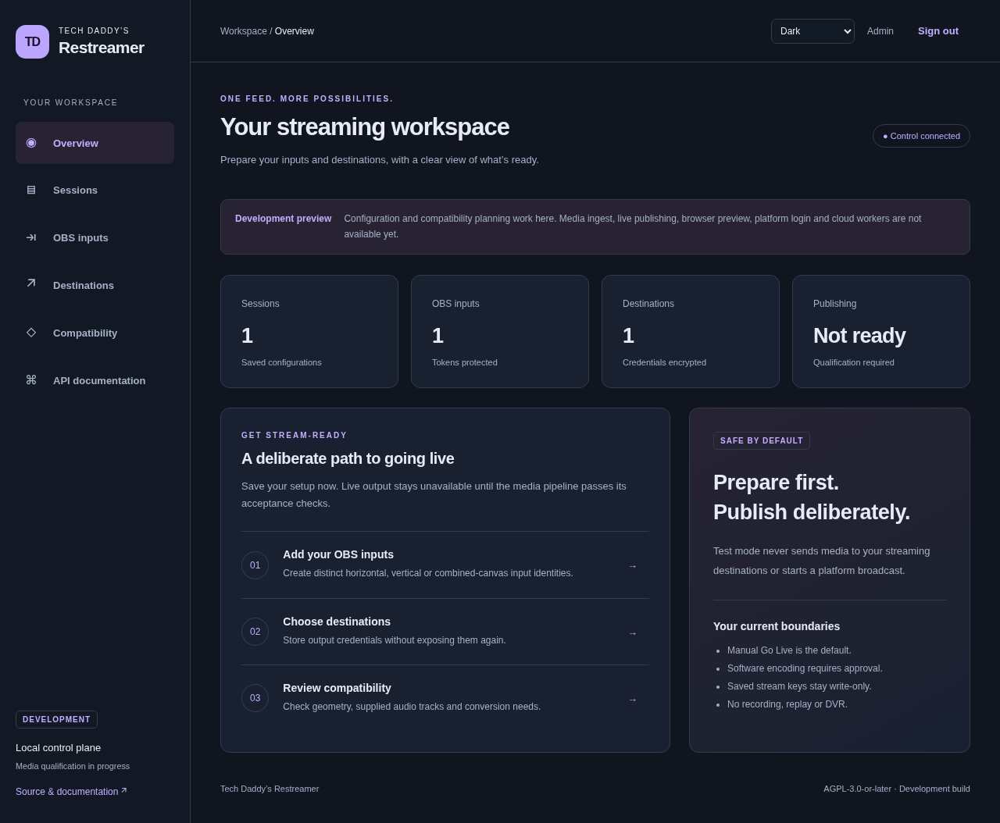

# Tech Daddy's Restreamer

Self-hosted, multi-tenant OBS restreaming appliance. **Development foundation — not a qualified v1 release.**

Go services, React/TypeScript, PostgreSQL, FFmpeg and MediaMTX. AGPL-3.0-or-later.

## Start here

- [Original specification](restream-appliance-spec.md)
- [Approved implementation plan](docs/plan.md)
- [Decisions](docs/adr/0001-architecture.md)
- [Requirement and acceptance ledger](docs/requirements.md)
- [Development](docs/development.md)
- [Installation](docs/installation/README.md)
- [Status and evidence](docs/evidence/status.md)

The approved v1 includes all named destination integrations, hardware families,
remote workers and AWS/RunPod orchestration. An incomplete feature remains a
release blocker; a successful build or mocked test is not media certification.

Every milestone includes code, meaningful automated tests, documentation and
recorded evidence. See CONTRIBUTING.md for the Git workflow.

## Current interface

The development UI exposes configuration and clearly marks media execution as unavailable.

