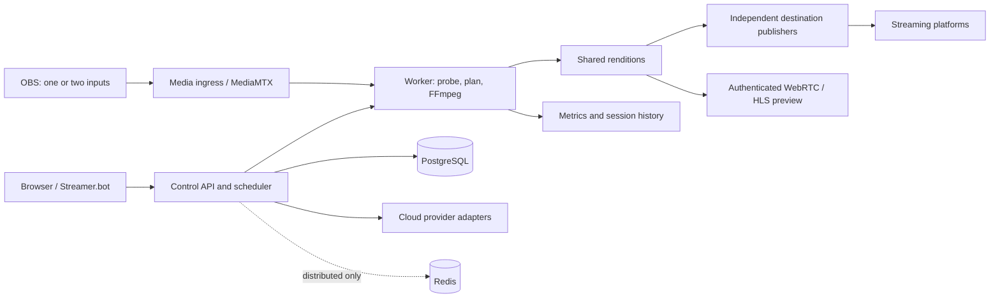

# Restreaming Appliance — Codex Implementation Specification

**Revision:** 0.1 · **Date:** 2026-09-30 · **Status:** requirements baseline and proposed implementation plan; unresolved decisions explicitly listed.

**Current scope amendment:** The owner subsequently selected a complete local
appliance on a secondary system for v1. [ADR 0003](docs/adr/0003-local-appliance-scope.md)
and the [approved plan](docs/plan.md) supersede this baseline's cloud,
AWS/RunPod, remote-worker, Redis, and provider-billing requirements and tests.
The original register below is retained for traceability; its R26, R29–R31,
Q02, A01, A14, A17 and M5 text is no longer an active v1 gate where it
requires those deferred capabilities.

## 1. Purpose and authority

Build a self-hosted restreaming appliance for non-technical streamers. OBS sends one or two feeds to the appliance. The appliance validates, optionally transforms, and distributes those feeds to selected streaming platforms, with test previews, health monitoring, historical statistics, and cost visibility. Deploy the same product locally or in the cloud, with optional remote and dynamically provisioned media workers.

This specification incorporates all six turns returned for [Compare Restreaming VPS Prices](chatgpt-conversation://6abcf3cb-c790-83ea-81d2-b9819323407d), including the user's complete 50-answer requirements message. The conversation reader reported no additional pages. Earlier assistant suggestions and price estimates are context, not user commitments or verified benchmarks. The final user answers override earlier suggestions, including suggestions to postpone orchestration, omit OAuth destination integrations, use SQLite, or target ten sessions.

Requirement labels:

- **LOCKED:** explicitly requested or accepted by the user.
- **PROPOSED:** recommended implementation choice, not a locked user decision. Technical design below is proposed unless explicitly labeled otherwise.
- **OPEN:** requires a product decision or a feasibility result before the dependent feature is considered specified.
- **GATE:** evidence required before claiming support or releasing the feature.

Codex must preserve locked requirements, implement reversible foundations without waiting for every decision, and raise the listed questions before committing dependent behavior. Do not silently substitute an easier feature or declare unsupported platform behavior supported. A v1 release requires completion of the locked scope or explicit approval of a scope change.

## 2. Locked requirement register

Numbers correspond to the user's final answers; this register is the traceability baseline.

| ID | Requirement | Primary sections |
|---|---|---|
| R01 | Multi-tenant design everywhere; local installs generally single-user, cloud may be multi-user | 4, 6 |
| R02 | Discord primary login, Google fallback; local authentication for LAN and initial cloud setup | 6 |
| R03 | Admin, operator/mod, streamer, viewer/read-only roles | 6 |
| R04 | Plain RTMP allowed on private LAN by default; no default public exposure | 7, 15 |
| R05 | Standard, dual-input, combined-canvas modes | 7 |
| R06 | Layout presets and custom rectangles | 7 |
| R07 | Automatic vertical generation: center/positioned crop, blur/fill | 7 |
| R08 | YouTube H/V, Twitch H/V, Kick, X, Rumble, generic RTMP/RTMPS in v1 where supported | 8 |
| R09 | Platform OAuth/API integration in v1 where supported | 8 |
| R10 | Recommended common profile plus advanced per-service profiles/settings | 9 |
| R11 | Compatibility engine is core | 9 |
| R12 | Recommend transcoding profiles while retaining user choice | 9 |
| R13 | Software x264 fallback, strongly discouraged | 10 |
| R14 | Automatic GPU assignment, including multiple GPUs | 10 |
| R15 | Multiple audio tracks; supported services use them; choose track for single-track services | 11 |
| R16 | “none in v1?” for recording: tentative exclusion requiring confirmation | 22, 23 |
| R17 | No replay/DVR | 23 |
| R18 | Test live OBS feed, stats, browser preview, validation, H/V processing, destination review; send nothing externally | 12 |
| R19 | WebRTC preview preferred, HLS fallback | 12 |
| R20 | User chooses go-live behavior during setup/testing | 12 |
| R21 | Independent destination retry with exponential backoff | 12 |
| R22 | Health dashboard and configurable issue notifications | 13 |
| R23 | Notification priority: Discord webhook/DM, web, email | 13 |
| R24 | Input and output metrics, drops, state, CPU/RAM/GPU/encoder usage, uptime, bandwidth | 13 |
| R25 | Historical statistics | 13 |
| R26 | Bandwidth accounting, connected provider costs where available, manual pricing fallback; popular providers in v1 | 14 |
| R27 | Secrets write/replace, never reveal stored values | 6, 17 |
| R28 | PostgreSQL everywhere | 4, 16 |
| R29 | Redis only in distributed/cloud-worker mode | 4, 10 |
| R30 | Cloud orchestration starts in v1 | 10 |
| R31 | Remote workers in v1 | 10 |
| R32 | LAN discovery via mDNS and IP/hostname | 15 |
| R33 | LAN HTTP sufficient; HTTPS elsewhere | 15 |
| R34 | Optional bundled Caddy; external proxy including Nginx Proxy Manager | 15 |
| R35 | Standard networking default, configurable host/bridge options | 15 |
| R36 | Most configuration in web UI/database | 4, 16 |
| R37 | Backup/export and restore | 17 |
| R38 | Update notifications; UI update option or CLI instructions | 17 |
| R39 | Prometheus metrics from day one | 13 |
| R40 | Fully documented REST API and interactive documentation | 18 |
| R41 | Streamer.bot integration and instructions | 18 |
| R42 | OBS uses custom streaming-server configuration | 7, 18 |
| R43 | Admin-configurable limits; default no quotas | 10 |
| R44 | AGPLv3 | 20 |
| R45 | Performant implementation with understandable code commentary | 5 |
| R46 | Non-technical UX, coherent navigation, explanations, tooltips, light/dark/color-blind adaptations | 19 |
| R47 | x86-64 Linux CPU/Intel/NVIDIA/AMD; ARM64 Linux CPU where feasible, all in v1 | 21 |
| R48 | Minimum N100/8 GB/1 GbE; recommended N100/N305 or Intel 8th-gen+/16 GB; pro Arc A310 or NVIDIA equivalent | 21 |
| R49 | Five simultaneous sessions initially; detect hardware and advise reasonable capacity | 10, 21 |
| R50 | Reliable restreaming, transforms, monitoring; not a cloud studio | 23 |

Cross-cutting locked deployment requirement: portable containers on a local appliance or cloud platform. A single container is preferred only if it is the better deployment; Compose is acceptable.

## 3. Vocabulary and product boundaries

- **Tenant:** isolated streaming workspace, potentially containing multiple members. Single-user mode hides collaboration controls without removing tenant isolation.
- **Session:** one streamer's logical broadcast/test run, potentially two inputs, several renditions, and many destinations. Five sessions does not mean five encodes or five destinations.
- **Input:** authenticated published media feed: master, horizontal, or vertical.
- **Rendition:** an encoded or copied media variant, including its transform and audio mapping.
- **Destination:** one logical platform output. A platform adapter may need several transport tracks or connections for one logical output.
- **Worker:** agent controlling media processes on one machine; reports measured capabilities and owns leased jobs.
- **Profile:** immutable revision of desired media settings. Sessions reference revisions, not mutable live forms.
- **Platform integration:** account authorization and broadcast/stream management. Separate from Discord/Google dashboard login.
- **Provider integration:** infrastructure provisioning and/or cost retrieval. Those capabilities are independently declared.

The portable contract is an OCI container deployment with documented network, storage, process-lifetime, and device requirements. “Any cloud platform that deploys containers” cannot guarantee media support on HTTP-only, short-lived, UDP-blocked, or GPU-inaccessible products. Such platforms may host the control plane while compatible remote workers host media. Publish a capability check instead of claiming universal full-stack compatibility.

## 4. Architecture and service boundaries

**PROPOSED:** Docker Compose is the canonical self-hosted distribution. PostgreSQL remains a separate durable service everywhere. Use one application image with different entrypoints where practical; do not bundle a database and device drivers into a giant application container merely to reduce the container count.



| Service | Responsibilities | Deployment |
|---|---|---|
| App/control | Web assets, REST, login/RBAC, configuration, compatibility planner, scheduler, reconciliation, integrations, audit | Required |
| PostgreSQL | Durable configuration, desired state, job ownership, history, cost records, migrations | Required everywhere; managed PostgreSQL permitted |
| Media gateway | Publish/read authentication, routing, internal rendition paths, preview transports | Required media function; proposed MediaMTX |
| Worker agent | Probe devices, launch/supervise FFmpeg and publishers, telemetry, process cleanup, execute versioned plans | Local by default; remote supported |
| Redis | Distributed dispatch/event fanout; recoverable from durable desired state | Enabled only for distributed/cloud-worker mode |
| Caddy | Optional UI/API/HTTP preview reverse proxy and HTTPS | Optional profile |
| Update executor | Narrow privileged deployment operation, separate from ordinary web service | Optional host-managed companion; decision required |
| Prometheus/Grafana | Scraping and visualization | Optional deployment; application metrics endpoint mandatory |

MediaMTX supports several relevant protocols and HTTP/JWT authentication, making it the initial gateway candidate. Its suitability for the exact multi-track paths must still be proven. See [MediaMTX introduction](https://mediamtx.org/docs/kickoff/introduction) and [authentication](https://github.com/bluenviron/mediamtx/blob/main/docs/2-features/06-authentication.md). SRS is a contingency if the critical protocol spike fails, not a second gateway implementation to maintain casually.

Single-node operation uses PostgreSQL jobs/outbox plus a local executor, without Redis. Distributed operation adds Redis dispatch, but PostgreSQL remains authoritative. A lost Redis queue must be reconstructible. Media does not flow through Redis or the web application.

Deployment modes:

1. **Local appliance:** all services on one host, one visible tenant by default, LAN HTTP/RTMP allowed, local hardware acceleration.
2. **Cloud all-in-one host:** same Compose stack, public TLS, optional multiple tenants and GPU access.
3. **Control plane plus existing remote workers:** enrolled CPU/GPU machines; operators manage their infrastructure.
4. **Control plane plus on-demand cloud workers:** provider adapters provision, register, prepare, drain, and terminate workers.
5. **Hybrid:** local ingress/control and remote processing, or cloud control and local media. Explicitly display every media transfer and its cost/privacy implications.

Provide separate Compose overlays/profiles for hardware, distributed mode, public proxy, and external proxy. Single-container cloud products may run a worker image connected to an external control plane; full all-in-one packaging is an open follow-up, not a v1 dependency. Kubernetes portability is architectural; a supported Helm chart is not locked.

## 5. Language, stack, repository, and code quality

**PROPOSED:** Go for control plane and worker agents; React and TypeScript for the UI; PostgreSQL with explicit SQL migrations and typed queries; FFmpeg for media processing; MediaMTX for routing; OpenAPI for REST contracts. Use a supported stable toolchain and pin exact versions/digests when implementation begins.

Go is recommended for readable concurrent service code and straightforward deployment. It is not asserted to be the universally fastest language. FFmpeg and hardware codecs do the expensive media work; language microbenchmarks should not drive control-plane design. Rust remains an alternative if profiling or team preference justifies its added implementation complexity. The language decision remains open for ratification.

Suggested layout:

```text
cmd/{control,worker,admin}/
internal/{auth,tenancy,profiles,planner,scheduler,sessions,secrets,history}/
internal/{platforms,providers,notifications,updates,backup}/
media/{gateway,ffmpeg,devices,publishers}/
api/{openapi,events}/
web/
db/migrations/
deploy/{compose,proxy,workers}/
docs/{adr,installation,hardware,integrations,operations}/
tests/{fixtures,integration,e2e,hardware,chaos}/
```

Comment intent, safety invariants, synchronization, protocol quirks, and tradeoffs. Avoid comments that merely restate syntax. Each platform/device adapter must have documented capabilities and tests. Use structured argument arrays for FFmpeg; never build commands from shell-interpolated user input. Changes include relevant docs and actionable error messages. Record consequential decisions as ADRs.

## 6. Identity, tenancy, authorization, and secrets

**LOCKED:** Discord primary, Google fallback, local auth on local deployments and initial cloud setup; four role classes; stored secrets never revealed.

Proposed identity model: internal user IDs with separately linked provider identities. Linking Google and Discord requires an authenticated link flow; matching email addresses alone must not merge users. OAuth state/PKCE where applicable, secure sessions, CSRF protection, session revocation, login rate limits, and safe callback URL configuration are required implementation controls. Discord outages must not stop established media sessions.

First-run bootstrap uses a one-time administrator setup credential delivered through the installation process. No shared default password. Cloud bootstrap credentials are disabled or converted according to the recovery policy decided in Q04. Local authentication uses a modern salted password hash. Local HTTP availability does not imply anonymous access.

Proposed role matrix, pending exact operator boundaries:

| Action | Deployment admin | Tenant streamer/owner | Tenant operator/mod | Viewer |
|---|---|---|---|---|
| View assigned dashboard/history | Yes | Yes | Yes | Yes |
| Start/test/stop assigned stream | Yes | Yes | Yes | No |
| Edit profiles/destinations | Yes | Yes | Delegated permission | No |
| Replace destination secrets | Yes, audited | Yes | No by default | No |
| Manage tenant members | Yes | Own tenant, if granted | No | No |
| Manage infrastructure/providers/updates | Yes | No | No | No |
| Reveal stored secrets | Never | Never | Never | Never |

Tenant IDs appear on every tenant-owned row, API authorization path, event subscription, preview URL, metric query, and worker job. PostgreSQL row-level security is recommended as defense in depth, with pooled-connection context-reset tests. Deployment administrators' cross-tenant access must be explicit and audited.

Separate credentials for dashboard sessions, OBS publication, preview readers, platform connections, worker enrollment, automation tokens, and cloud providers. Hash ingest and API tokens when only verification is needed. Encrypt retrievable outbound credentials with envelope encryption; keep the root key outside database backups or protect it separately. Rotation must support decrypting existing records while rewriting them under the new key.

Write-only UX: show status, last replacement date, and safe identity metadata. New ingest tokens may be shown once at creation, then only rotated; whether R27 permits this one-time disclosure must be confirmed. An alternative is user-supplied OBS secrets. Remove the earlier conversation's stored-key “Reveal” button.

Never put secrets in logs, error pages, tracing, process listings visible across tenants, metrics labels, or backup previews. Workers receive only secrets needed for active jobs via an authenticated encrypted channel. Host root can inspect a running process; “never reveal” is an application/API guarantee, not protection against a compromised host administrator.

Destination URLs, notification URLs, and provider endpoints require SSRF controls, protocol restrictions, redirect/DNS revalidation, and a deliberate admin-approved private-network exception for LAN targets. Redact query strings and stream-key path components.

## 7. Ingest and transformation

**LOCKED:** OBS custom streaming server; three input modes and vertical generation. **PROPOSED, pending Q03:** RTMPS and encrypted SRT in v1 in addition to LAN RTMP; the final answer explicitly confirmed LAN RTMP but did not separately enumerate the other two protocols.

Give each input a stable identifier, publish credential, and copyable OBS instructions. Distinguish horizontal and vertical inputs without guessing from connection order. Reject a second publisher to an occupied input or use a documented takeover policy. Validate stream ownership before accepting media.

| Mode | Input | Processing |
|---|---|---|
| Standard | One normal horizontal stream | Copy where compatible; optional generated vertical rendition |
| Dual input | Independent horizontal and vertical streams | Probe and route separately; transform only when required |
| Combined canvas | One encoded canvas with two regions | Decode, extract rectangles, scale if needed, encode H/V |

Provide presets and a visual rectangle editor with numeric coordinates, bounds checking, aspect-ratio guidance, and encoder/chroma alignment validation. A 3000×1920 illustrative canvas can contain 1920×1080 at (0,0) and 1080×1920 at (1920,0); this is an example, not a mandated format. Cropping a compressed canvas requires decoding/re-encoding; do not call it direct copy.

Generated vertical supports center crop, configurable crop position, fit with background fill, and blurred background. Specify output dimensions, frame rate, fit behavior, and safe-area preview. Blur can add GPU/CPU work beyond encoding; scheduler estimates must include it. AI subject tracking, scene composition, and overlay authoring are not implied.

Probe codecs, codec profile/level, pixel format/bit depth, dimensions, actual frame rate, color metadata, bitrate distribution, keyframe timing, audio tracks, sample rates, channel layouts, and timestamps. Collect a sufficient observation window before marking bitrate/GOP findings verified. Show “waiting for enough data” instead of false success.

Source changes during a session trigger revalidation. Do not silently change output dimensions or replace the user's audio selection. Define whether incompatible changes stop the affected output or apply a preapproved fallback. Dual-input loss should affect only dependent destinations by default; synchronized all-or-nothing start is an open option.

## 8. Destination and account adapters

**LOCKED:** all named destinations belong in v1, with OAuth/API integrations wherever supported. Manual RTMP/RTMPS credentials remain necessary for unsupported or inaccessible APIs.

| Destination | Required product behavior | Evidence gate |
|---|---|---|
| YouTube horizontal and vertical | Separate logical targets/renditions; account connection and available broadcast/stream management | Verify account eligibility, API scopes, event association, simultaneous H/V behavior |
| Twitch horizontal and vertical | Logical H/V selection with correct platform delivery mechanism | Prove dual-format negotiation/multiplexing and account eligibility; do not assume two ordinary stream keys |
| Kick | Supported ingest plus available OAuth/API controls | Verify which API operations expose ingest credentials or manage broadcasts |
| X/Twitter | Supported ingest configuration plus available API controls | Verify account access, Producer workflow, API availability and current encoding rules |
| Rumble | Supported ingest configuration plus available API controls | Verify account-specific access, credential and broadcast workflow |
| Generic RTMP/RTMPS | User endpoint/key, chosen profile and audio mapping | Protocol connectivity and local profile validation; no invented platform guarantees |

YouTube exposes distinct liveStream and liveBroadcast resources; the adapter must model their relationship. [YouTube API reference](https://developers.google.com/youtube/v3/live/docs?hl=en).

Twitch documents Enhanced Broadcasting as the mechanism enabling Dual Format Streaming. Consequently, a “Twitch vertical” card alone does not establish support: the actual wire protocol and account behavior must pass the milestone-0 spike. [Twitch Enhanced Broadcasting](https://help.twitch.tv/s/article/multiple-encodes).

For every adapter publish a capability record: supported transports, credential method, account eligibility, event lifecycle operations, orientation semantics, audio-track behavior, hard limits versus recommendations, source URL, review date, tested version, and known limitations. Unknown behavior stays unknown until verified.

OAuth connection, token refresh, reauthorization, revocation, minimum scopes, API quota handling, and per-account errors are part of v1 where available. Login with Google does not automatically authorize YouTube publishing. A connected account must not imply that all broadcasting features are enabled.

No unsupported scraping or invented APIs. If an API requires approval, credentials, or an account unavailable to testing, record the blocker; retain the v1 requirement rather than silently deleting it. Manual fallback must be visible and explained. Stop/start behavior must distinguish sending media from creating, transitioning, or ending a platform broadcast.

## 9. Compatibility and profile engine

The engine is deterministic and explainable. Input: observed media, input mode/layout, enabled destinations and account capabilities, versioned platform rules, user choices, and available worker capabilities. Output: recommended common profile, per-destination compatibility, proposed rendition graph, resource estimate, and reasons.

Algorithm:

1. Normalize observed input facts with confidence and observation age.
2. Resolve hard destination constraints separately from quality recommendations.
3. Check video copy, audio copy/remap/re-encode, and packaging independently.
4. Find a common compatible profile for each orientation where possible. If the intersection is empty, explain why and propose the smallest useful set of profiles.
5. Respect advanced destination overrides. Invalid hard constraints are blocked; merely suboptimal settings produce warnings.
6. Group identical processing graphs into shared renditions. Include source, crop, resolution, FPS, codec/profile, pixel format, rate control, bitrate, GOP, audio mapping, and latency requirements in equivalence checks.
7. Reserve resources, then issue an immutable plan revision. Show differences before applying changes to a live session.

UI result categories: **Direct copy**, **Audio conversion only**, **Video conversion required**, **Unsupported**, **Not yet verified**. Explain whether the conversion is required by a transform, protocol, codec, audio choice, or platform constraint. Copy does not mean zero CPU or zero bandwidth.

Provide a recommendation matrix for the selected services, plus advanced per-destination resolution/FPS/bitrate/GOP/codec/audio/backend choices. H.264/AAC is a proposed broad-compatibility starting point, not a universal fixed bitrate or current platform guarantee. Numeric platform limits must be sourced and tested at implementation time; do not copy old conversation values into permanent code.

Rules ship as versioned data with schema validation and regression fixtures. Sessions pin the rule revision; a rule update cannot mutate a running stream unexpectedly. Show stale rule warnings and allow an admin to roll back rules. No silent cloud downloads of untrusted executable rule code.

Each shared encoded rendition feeds independent publisher processes or equivalently isolated queues. A blocked destination must never stall a shared encoder or other destination. Queues are bounded; reconnect starts on a usable keyframe. Verify this behavior rather than assuming a multi-output FFmpeg process provides isolation.

## 10. Hardware scheduling, orchestration, and limits

**LOCKED:** GPU assignment, remote workers, cloud orchestration in v1, x264 fallback, five-session initial target, optional admin limits with no quotas by default.

Worker registration reports architecture, agent/media versions, CPU/RAM, device identifiers, driver versions, decode/encode/filter capabilities, supported formats, free resources, measured throughput, and health. Run a short real encode/decode smoke test; finding an encoder name in FFmpeg is insufficient proof of a working device.

Backend candidates: Intel QSV/VAAPI, NVIDIA NVDEC/NVENC, AMD VAAPI on Linux, and software x264. Do not require AMF if the supported Linux path is VAAPI. Use hardware filters and shared decoded surfaces where feasible; record CPU transfers and fallback filters honestly. Preview transcoding and audio conversion also consume scheduled capacity.

A scheduler chooses compatible devices using measured capacity and existing reservations, not GPU model names alone. Account for decode/encode throughput, resolution/FPS, pixel format, filter load, memory, network, and driver session constraints. Automatic assignment is required; manual pinning/affinity is proposed. GPU engine count is not equivalent to encoder-session count or guaranteed concurrency.

No quotas by default means no arbitrary product cap of five. Physical admission checks remain necessary. Admins may set per-tenant/session bitrate, resolution/FPS, destination count, concurrent sessions, CPU/RAM, encoder use, bandwidth budgets, and worker/provider restrictions. Proposed behavior when capacity is unavailable: queue or reject clearly; never degrade other sessions or silently switch to expensive software encoding. x264 is an explicit user-approved choice with prominent load guidance; approval granularity remains Q10.

Remote protocol: mutually authenticated encrypted control connection, one-time enrollment token, short-lived worker credentials, heartbeat, capability refresh, version negotiation, scoped job secrets, and revocation. Prefer worker-initiated connections so home workers need no public management port.

Durable job record includes job ID, session/tenant, plan revision, desired state, owner, lease expiration, fencing epoch, resource reservation, and observed state. Dispatch is at least once; commands are idempotent. Only the current fenced owner may publish. A worker that loses lease authority must stop publishing before a replacement becomes active. Define the grace period explicitly; it trades continuity against duplicate-stream prevention. Queue delivery alone never establishes ownership.

Cloud provider adapter interface:

```text
Capabilities(), ListRegions(), ListInstanceTypes(), Quote()
Provision(idempotencyKey, spec), Inspect(resourceID)
Start(), Stop(), Terminate(), ListOwnedResources()
ReadUsage(), ReadCosts()  // optional independent capabilities
```

Provisioning state: requested → provisioning → enrolling → self-test → ready → busy → draining → idle → terminating → terminated, with explicit failed/reconciling states. Persist provider resource IDs before continuing. Tag resources with deployment and operation IDs. Reconcile timeouts against provider inventory before retrying creation. Clean orphaned owned resources using policy, never unrelated resources.

Support prepare-before-stream and optional provision-on-ingest. Cold starts cannot promise immediate broadcasting or replay of the waiting interval. Do not buffer minutes of media to hide provisioning delay; DVR is excluded. Show ready/waiting/failure clearly. Idle shutdown must consider all sessions and in-flight assignments on a worker. Expose remaining storage/IP costs after stop where known.

Provider shortlist from the conversation: AWS, Azure, Akamai/Linode, RunPod, TensorDock, with OVH and others discussed. **OPEN:** which receive provisioning and which receive billing integrations in v1. Implement the interfaces plus contract tests now; finalize named adapters before their milestone. Manual/existing-worker support alone does not fulfill the orchestration requirement.

Stable ingest options are separate from scheduling:

- **Static appliance/worker:** fixed endpoint, simplest deployment.
- **Stable ingress edge → worker:** stable OBS address; forwards compressed inputs and adds transfer cost. Publishers send directly from the processing worker to destinations.
- **Per-streamer DNS → worker:** avoids an extra hop, but DNS caches and existing connections prevent seamless migration; requires readiness and reconnect handling.

Recommended distributed default is a stable ingress edge, subject to Q08. Do not route every outgoing platform copy back through the control plane. Failover is reconnect-based in v1 unless explicitly expanded; no promise of gapless migration.

## 11. Audio

Preserve multiple incoming tracks end to end. Model stable input track IDs plus labels such as live mix and VOD mix; channel count and audio-track count are different. For single-track destinations, users select exactly which track to send. For supported multi-track destinations, map each track to the platform's required purpose and packaging.

Do not imply the appliance can remove music from a mixed track. OBS must supply separate mixes. If a selected track disappears or is never received, show an error and apply only an explicitly configured fallback; never silently substitute a music-containing mix for a music-free mix.

The transport spike must prove OBS → ingress → internal rendition → destination publisher track preservation. Ordinary RTMP, enhanced RTMP, and SRT/container paths cannot be treated as interchangeable. MediaMTX's FFmpeg guidance includes specific enhanced-RTMP handling for multiple tracks, reinforcing the need to pin and test actual builds. [MediaMTX FFmpeg reading guidance](https://mediamtx.org/docs/read/ffmpeg).

Provide per-track meters and audition selection in preview, codec/sample-rate/channel validation, audio-only conversion when needed, and A/V timestamp monitoring. Preserve timestamps during reconnect where possible; define discontinuity behavior and measure sync. Multi-input cross-feed audio reuse and audio mixing are open rather than implied.

## 12. Test mode, previews, session lifecycle, and failure behavior

Test mode is a safety boundary, not a platform “private” broadcast. It must accept real OBS media, inspect codec/bitrate/GOP/audio, show real-time stats, preview both orientations, show every configured destination's compatibility and selected audio/profile, and send no stream to an external destination.

**OPEN Q01:** the user said “send nothing externally.” Strictly interpreted, this also excludes remote cloud workers, external TURN/STUN, provider API calls, notifications, and remote browser preview. Until clarified, provide a strict local test path: local processing/preview, cached platform rules, and no test-triggered external integration calls. A cloud deployment can run a destination-isolated test only after its permitted browser/control/worker boundary is explicitly documented and accepted. Do not claim zero external network traffic while issuing external API calls.

Implementation invariant: test plans have no platform publisher jobs or platform broadcast transitions, and workers reject such jobs for a test session. Auto-go-live cannot override an active test session. Add network-observation tests, including after service restart and queued-command replay. Offline configuration validation is distinct from an online credential check; the latter requires a separate explicit action under strict test semantics.

WebRTC is preferred; HLS is fallback. Previews are authenticated and tenant-scoped, with expiring read authorization and no secret-bearing public URLs. Browser codec support may require a separate preview encode/audio conversion. Bound preview viewers, buffers, and CPU load through physical capacity accounting. HLS segments are short-lived preview buffers, not recording/DVR; clean them up after use. Exact TTL/window is proposed in Q12.

Proposed session states:

```text
Idle → Preparing → Waiting for input → Testing or Armed → Starting → Live
Live → Degraded → Live
Any active state → Stopping → Ended
Any active state → Failed (recoverable reason recorded)
```

Go-live options: **Manual/armed** accepts OBS but waits for Go Live; **Automatic** starts configured outputs when required inputs and capacity are ready. Recommend manual as the initial default; user selects the mode in setup/testing. Explicit Go Live issues a new live plan and clears the test boundary only after validation. APIs use idempotency keys and expected plan revisions to prevent double starts and stale actions.

Each destination has its own connecting/live/retrying/failed/stopped state. Retry transient failures with bounded exponential backoff and jitter; authentication/policy failures request corrective action rather than retrying forever. Retry timers, caps, and reconnect grace periods are configurable operational policy. A failing output cannot block other outputs. A shared encoder failure necessarily affects its consumers and must be reported as such.

Input loss pauses or closes dependent publishers according to a defined reconnect grace period. No automatic black screen, standby loop, or synthetic audio is implied. Manual Stop cancels retries and durable desired state so restarts cannot resurrect a stopped broadcast. Worker/control/database failures must surface state uncertainty rather than displaying a false “Live.”

## 13. Monitoring, notifications, and historical statistics

Expose Prometheus metrics from the first implementation milestone; running a Prometheus server is optional. Internal metrics endpoints require restricted access. Labels must be bounded and contain no tokens, destination URLs, or uncontrolled user text.

Collect input dimensions/FPS/bitrate, output bitrate and connection state per destination, observable packet/frame drops, reconnects, CPU/RAM, GPU memory/utilization, encoder utilization where available, process health, uptime/session duration, and byte counters. Unknown driver metrics display “unavailable,” not zero. Distinguish observed transport loss, encoder drops, and end-platform viewer health; the appliance cannot infer all three from one counter.

Dashboard includes input health, processing health, output health, capacity, and actionable reasons. Avoid claiming end-to-end latency without clocks and measurements that support it.

Store session summaries, time-series rollups, incidents, configuration/rule revisions, resource assignments, and cost estimates in PostgreSQL. Use UTC storage and user-local display. Handle counter resets, worker replacement, duplicate events, and partial sessions. Proposed retention: short detailed history plus longer rollups; exact periods are open, especially for the 8 GB appliance. Retention runs must bound DB/disk growth and not delete operationally active records.

Notification order: Discord webhook and DM support, browser/in-app, then email. DM delivery needs a separately configured supported Discord bot flow; dashboard OAuth does not grant arbitrary DM delivery. Browser notification permissions and HTTPS support vary; LAN HTTP must retain in-app status even if browser notifications are unavailable.

Per-user/tenant preferences select issue types, severities, channels, and recovery notices. Add deduplication, cooldowns, incident grouping, rate limits, retry queues, and delivery status. Redact secrets in all messages. Include input loss, output failures, encoder/resource pressure, worker loss, unexpected end, budget warnings, and operational backup/update failures. Health notifications are in scope; stream overlay alerts are not.

## 14. Bandwidth and cloud costs

Keep three separate values: **measured application bytes**, **estimated charges**, and **provider-reported charges**. Display time range, currency, pricing source/date, freshness, and attribution confidence. Provider billing can be delayed or aggregated; never label a per-session estimate as a provider invoice.

Manual pricing form supports compute billing unit and rounding, hourly/monthly caps where applicable, storage, public IP, egress tiers/allowances, region, currency, and optional other fixed costs. Provider connectors use read-only billing permissions where possible. Resource provisioning permissions are separate.

Example calculation, illustrative only:

```text
6 outputs × 6 Mb/s × 3,600 / 8 / 1,000 = 16.2 GB/hour
16.2 × 120 hours = 1,944 GB/month
```

These decimal units exclude extra audio if the given bitrate is video-only, protocol overhead, retransmissions, previews, edge-to-worker hops, and control traffic. Shared encodes reduce processing, not one-network-copy-per-destination egress. Account for inter-region and cross-provider transfers separately.

Track bytes at identifiable transfer boundaries and avoid double-counting the same hop across publisher/process/interface counters. Associate resources with sessions/tenants; shared-node cost allocation is an estimate with a visible method, proposed reservation-time or measured-utilization weighting. Reconcile actual totals without overwriting historical estimates invisibly.

V1 must include the agreed popular provider connectors plus manual fallback. Provider selection, billing scope, forecast method, and hard-spend-stop policy remain open. Do not reuse earlier conversational VPS prices as current tariffs. Budget warnings can ship independently of destructive automatic spending controls.

## 15. Networking, TLS, proxying, and discovery

Proposed default is a user-defined Docker bridge network with only intentional host port publication. Host networking is optional for supported Linux deployments; explain port collisions and reduced network isolation. “Standard” networking in the final answer is interpreted this way pending Q15.

| Traffic | Exposure policy |
|---|---|
| UI/API and HTTP preview | LAN HTTP permitted; public HTTPS required |
| Plain RTMP | Bind/publish only to selected LAN interface/subnet by default; never all public interfaces |
| RTMPS | Dedicated TCP listener with valid certificates; proposed public ingest |
| SRT | Explicit UDP listener, authentication and encryption for public paths; proposed |
| WebRTC | HTTPS signaling plus documented ICE/media ports; TURN only when configured |
| Database, Redis, metrics, gateway control API | Internal/private authenticated access; no default public publication |
| Worker management | Encrypted authenticated control channel; prefer outbound enrollment/connection |

Exact ports are configurable and documented in generated installation instructions. Private addressing alone is not sufficient access control; account for routing, IPv6, host firewalls, and Docker port publication. Public deployment preflight checks actual bindings and required certificate/hostname configuration.

Caddy covers HTTP reverse proxy/TLS. Do not assume its ordinary HTTP reverse_proxy handles raw RTMP/SRT. RTMPS certificates terminate at the media listener or an explicitly supported layer-4 proxy, with documented renewal. See [Caddy reverse_proxy documentation](https://caddyserver.com/docs/caddyfile/directives/reverse_proxy).

Ship Caddy and external-proxy recipes, including Nginx Proxy Manager, with WebSocket/event streaming, HLS, WebRTC signaling, forwarded-header trust, and media port instructions. Only trust forwarded headers from configured proxies. Ordinary CDN HTTP proxying does not imply RTMP/SRT/ICE support.

LAN discovery supports mDNS plus direct IP/hostname instructions. Keep mDNS on the local network; use an optional host discovery helper if bridge networking prevents multicast. Provide collision-safe naming. Cloud OAuth callbacks need appropriate public HTTPS addresses; document local OAuth redirect limitations and retain local login.

Test NAT, CGNAT, firewall-restricted browsers, and HLS fallback. External STUN/TURN requires explicit configuration consistent with test-mode policy. Do not require exposing a Streamer.bot control server publicly.

## 16. Data model and configuration ownership

PostgreSQL entities, proposed:

| Group | Entities |
|---|---|
| Identity | users, external_identities, tenants, memberships, roles/permissions, auth_sessions, api_tokens |
| Configuration | input_endpoints, ingest_credentials, stream_profiles, profile_revisions, layouts, destinations, platform_accounts, encrypted_secrets |
| Execution | sessions, session_inputs, rendition_plans, jobs, job_leases, destination_runs, worker_capabilities, resource_reservations |
| Infrastructure | workers, worker_enrollments, provider_accounts, provision_operations, cloud_resources |
| Operations | events/outbox, audit_events, notification_preferences/deliveries, metrics_rollups, session_summaries |
| Costs/lifecycle | pricing_rules, usage_counters, cost_estimates, provider_cost_records, backup_jobs, update_jobs, schema_versions |

Use immutable IDs and explicit ownership; unique constraints prevent duplicate provider operations and incompatible active jobs. Store desired and observed state separately. Transactions couple state changes with outbox events. Support optimistic revision checks for configuration edits and idempotency on external side effects.

UI/database owns stream configuration, layouts, destinations, preferences, limits, pricing, and worker policies. Environment/secret files own bootstrap DB connectivity, encryption keys, public origin, trusted proxy bootstrap, and deployment/device bindings. Do not store a setting in two places without clear precedence and an effective-value display.

Database migrations are versioned, rehearsed on populated databases, and compatible with the chosen update sequence. Tenant deletion, history deletion, and cloud-resource cleanup are separate operations with clear consequences.

## 17. Backup, restore, and updates

Encrypted portable export includes users/tenants, profiles/revisions, destinations, provider references, and protected credentials as selected. Distinguish configuration export from full PostgreSQL/history backup. A safe diagnostic export omits secrets entirely. The write-only rule prohibits plaintext reveals; it does not preclude encrypted administrative backups.

Use an authenticated encrypted archive with a manifest, schema/application versions, integrity verification, and a passphrase or separately held recovery key. Do not include an unprotected root key next to encrypted data. Restore validates compatibility before modifying the target, supports a dry-run summary, and starts with publishers/provisioning disabled until the operator intentionally resumes them. Re-enroll workers and reauthorize provider connections when needed. Test restore on a different clean appliance.

Update UI shows current/available version, source, release notes, migration implications, backup readiness, and active sessions. Pin image digests; verify signed release metadata where available. Never automatically update during a live session. Provide both explicit admin-triggered update capability on supported appliance installs and documented CLI/external-orchestrator instructions elsewhere; exact executor is Q11.

Do not mount an unrestricted Docker socket into the ordinary web application. Use a separate narrowly scoped executor or host service for approved update operations. Managed cloud environments may expose only an external deployment workflow. Report progress and partial failures honestly.

Before update: validate disk space, take verified backup, drain or wait for sessions, then update in a compatible order and run health checks. Rollback includes database compatibility; swapping old containers after an irreversible migration is not a valid generic rollback. Retain a tested recovery path, version compatibility policy, and an audit trail.

## 18. REST API and Streamer.bot

Versioned `/api/v1` REST API with an OpenAPI document and interactive UI. Every meaningful UI control has a documented API equivalent. Separate public user API, internal stream-auth callbacks, and worker protocol.

Core resource families:

```text
/auth, /users, /tenants, /memberships
/inputs, /profiles, /destinations, /platform-connections
/compatibility/evaluate, /plans
/sessions/{id}/test, /prepare, /go-live, /stop
/sessions/{id}/destinations/{destinationId}/start|stop|retry
/sessions/{id}/health, /history, /usage, /costs
/workers, /provider-connections, /provision-operations
/notification-preferences, /backups, /updates
/events, /webhook-subscriptions
```

Specify schemas, scoped permissions, errors, pagination, rate limits, idempotency keys, revision conflicts, asynchronous operation IDs, and examples. Use machine-readable reason codes plus understandable messages. Never return secret values from GET operations.

Events include input connected/disconnected, session prepared/started/stopped, destination online/offline, health warning/recovered, worker state, and provisioning failure. Each event has ID, schema version, tenant, session/resource IDs, timestamp, sequence where applicable, and correlation ID. Browser events use SSE or WebSocket; signed outbound webhooks have retries and deduplication semantics. Event retention/replay is bounded and documented.

Streamer.bot deliverables: importable example actions or scripts, scoped-token setup, tested version, connection guide, and troubleshooting. Include prepare/test/go-live/stop, destination enable/disable, query health, and react to incident/recovery events. Proposed integration uses Streamer.bot calling REST and maintaining an outbound event connection when behind NAT. If a local bridge is necessary, ship and document it. Streamer.bot documents HTTP and WebSocket APIs; use supported interfaces rather than UI automation. [Streamer.bot API documentation](https://docs.streamer.bot/api/).

API tokens cannot elevate the owner's role. Stop/retry actions are safe to repeat. Test mode stays enforced through automation; a Streamer.bot action cannot accidentally publish through a test-session API. OBS remains a custom streaming server client; no custom OBS plugin is required in v1. Document any existing OBS output setup needed to send dual feeds or multiple audio mixes.

## 19. UI, UX, and accessibility

The normal journey is **Set up appliance → connect accounts → configure OBS inputs → choose destinations → review recommended profile → test → go live → monitor → review history**. Installation instructions must clearly distinguish host prerequisites from everyday streaming use.

Primary pages: Overview, Stream setup, Test/Preview, Live health, Destinations/Accounts, History/Costs, Notifications; admin-only Workers, Providers, Members/Limits, Backups/Updates, and System diagnostics. Single-user mode hides unnecessary tenancy navigation.

Show common recommendations first and advanced controls progressively. Every conversion recommendation explains the reason, quality effect, estimated resource use, and possible extra cost. Display which outputs share an encode. Hardware capacity advice has confidence and tested workload, not a misleading exact percentage based on a GPU name.

Always-visible status distinguishes Testing, Armed, Going live, Live, Degraded, and Stopped. Test preview clearly states its delivery boundary. Destination cards show selected orientation and audio track. Before applying a disruptive live change, show affected outputs and whether a restart is required. Preserve drafts and provide actionable validation near the field.

**LOCKED:** light and dark themes, color-blind adaptations, clear descriptions, tooltips, coherent design. **PROPOSED:** WCAG 2.2 AA acceptance target; keyboard operation, visible focus, screen-reader labels, accessible live-status announcements, text/icon states independent of color, sufficient contrast, reduced motion, responsive layout, and no essential tooltip-only instructions. Test crop editing with keyboard/numeric controls as well as mouse.

Browser notification permission prompts occur after a user gesture. Browser limitations never remove in-app error visibility. Empty/loading/disconnected states explain next steps without exposing internal stack traces.

## 20. Licensing and distribution

**LOCKED:** project license AGPLv3. **OPEN:** AGPL-3.0-only versus AGPL-3.0-or-later. Include license files, notices, build instructions, and a source link matching the running release. GNU describes the AGPL's network-source provision; implementation and distribution must preserve the applicable obligations. [GNU license guidance](https://www.gnu.org/licenses/gpl-howto.en.html).

Maintain an SBOM and third-party notices for each image, including FFmpeg configure flags and enabled libraries. FFmpeg's licensing depends on its build configuration, including GPL components such as x264; do not assume every binary is simply LGPL or redistributable. Review vendor SDK/driver and dependency terms for the actual shipped artifacts, including the chosen Redis version. [FFmpeg license and legal considerations](https://www.ffmpeg.org/legal.html).

Separate host-installed drivers from application containers where practical. AGPL does not settle codec patent licensing or platform API/branding terms; record distribution issues for review before release. No proprietary dual-license/commercial edition requirement is implied.

## 21. Supported hardware and deployment matrix

All rows are v1 targets, not already-certified claims. Publish actual OS/kernel/driver/FFmpeg versions, fixtures, results, and known limitations.

| Target | Intended supported workload | Certification gate |
|---|---|---|
| x86-64 Linux CPU-only | Copy/remux, audio conversion; explicit x264 fallback | Five relay sessions on a documented reference host; CPU encode capacity separately measured |
| x86-64 Intel iGPU | Copy plus QSV/VAAPI transforms | N100 reference and an 8th-gen+ reference; crop/scale/blur paths tested independently |
| x86-64 NVIDIA | NVDEC/NVENC transforms and multi-device scheduling | Real supported GPU/driver/container runtime; capacity and session restrictions verified |
| x86-64 AMD | VAAPI transforms on supported devices | Real supported AMD device; codec/filter capability probes and sync/quality tests |
| ARM64 Linux CPU | Relay plus bounded software fallback where feasible | Native ARM64 image and real-device test; no implied ARM hardware encoder support |
| Cloud CPU/GPU VM or container host | Same modes as exposed devices/network permit | Persistent processes, port access, durable DB, device access, restart behavior |
| Restricted container platform | Control plane and/or worker subset only | Explicit limitations; compatible external media worker required when necessary |

Hardware tiers accepted by the user:

- **Minimum appliance:** Intel N100, 8 GB RAM, 1 GbE. Proposed storage baseline: 64 GB SSD, subject to history retention measurement.
- **Recommended:** N100/N305 or Intel 8th-gen+, 16 GB RAM. Proposed 128–256 GB SSD.
- **Pro:** Intel SFF plus Arc A310 or an appropriate NVIDIA device. Exact equivalence is benchmark-based.

N100 is a minimum appliance target, not a promise of five concurrent combined-canvas transcodes. Test one-session transformation workloads separately and publish achievable throughput. Five-session software design must be proven on adequate hardware. Multi-tenant cloud deployments scale resources according to actual rendition count.

Network sizing uses aggregate destination bitrate plus all other media hops and headroom. 1 GbE does not imply the household Internet upload can support all outputs. Provide an estimate from selected destinations and an optional explicit bandwidth test. No hardcoded “100 Mb/s is always enough” claim.

## 22. Open decisions and release risks

Resolve product choices in an ADR or decision log with owner, date, and downstream impact. Recommendations below are not approvals.

| ID | Decision/question | Recommended direction / blocking point |
|---|---|---|
| Q01 | Does test mode prohibit all external traffic, or only external broadcast/media delivery? Are authorized remote preview/workers allowed? | Explicit boundary modes; strict local default until clarified. Blocks cloud test semantics |
| Q02 | Which named providers get provisioning and which get actual-cost integration in v1? | Pick a small explicit set from AWS/Azure/Akamai/RunPod/TensorDock; billing and provisioning need not match. Blocks adapter milestone |
| Q03 | Confirm RTMPS and SRT as required v1 ingest protocols | Recommend both; answer R04 explicitly confirmed only LAN RTMP policy |
| Q04 | Cloud local login after bootstrap: disabled, recovery-only, or normal fallback? | Recovery-only with documented rotation; blocks final auth policy |
| Q05 | Is recording definitively excluded? | Yes for v1; original “none in v1?” is tentative |
| Q06 | Does write-only allow one-time display of newly generated OBS/API tokens and encrypted export? | Recommend yes; never reveal stored tokens later |
| Q07 | Tenant ownership and exact operator/member permissions? Open registration or invitations? | One initial owner, invitations, explicit operator grants |
| Q08 | Stable edge versus direct worker endpoint for distributed ingest? DNS provider integration? | Stable edge baseline; direct worker as explicit alternative |
| Q09 | What is the certification workload for five sessions: inputs, FPS, destinations, transforms? | Define relay and transform scenarios separately before performance signoff |
| Q10 | Automatic transcode and software fallback consent: per profile, per session, or deployment policy? | Preapproved profile policy; software fallback explicit and off by default |
| Q11 | Exact supported UI updater mechanism and behavior on managed container platforms? | Restricted companion for Compose, external workflow elsewhere |
| Q12 | History retention, preview buffer TTL, backup schedule, RPO/RTO, event retention? | Bounded defaults tuned to minimum appliance; measure storage before ratification |
| Q13 | Default go-live mode, dual-input readiness requirement, reconnect grace, worker lease grace? | Manual initially; independent input dependencies; explicit timeouts |
| Q14 | AGPLv3 only or or-later; ratify Go/React and MediaMTX after protocol spike? | Record before repository/license scaffolding is finalized |
| Q15 | Confirm “standard networking” means bridge default; which OS versions are certified? | Docker bridge; supported Linux distribution versions selected at build start |
| Q16 | Shared audio across dual inputs, mixing, or additional audio-only input needed? | Preserve/select supplied tracks first; mixing requires explicit scope |
| Q17 | Cost budgets warn only or stop resources? Which currency/tax/allocation rules? | Warn by default; no automatic live termination without explicit policy |
| Q18 | Which platform test accounts/approvals and Discord DM bot setup are available? | Obtain before external adapter acceptance; do not claim inaccessible features tested |

Highest risks:

1. Twitch dual-format and live/VOD audio may demand transport features beyond a simple FFmpeg fanout. Mitigate with the first spike; retain adapter flexibility.
2. Platform API access, OAuth approval, and account eligibility may prevent a uniform connection experience. Show exact capability and manual fallback; track release blockers.
3. Cloud container offerings differ in UDP, public endpoints, persistent lifetime, and encoder access. Certify capabilities rather than provider logos.
4. Hardware filtering and multi-track audio may be dropped or converted unexpectedly. Test end-to-end packets, rendered output, and audible track identity.
5. Five sessions can produce many more than five encodes. Use admission control, measured benchmarks, and resource reservations.
6. Remote-worker partitions can create duplicate publishers or unexpected bills. Use leases/fencing, idempotency, inventory reconciliation, and bounded shutdown policy.
7. Current pricing/encoding recommendations age quickly. Version rules, record dates, and distinguish estimates from provider billing.
8. A broad v1 is substantially larger than a relay MVP. Deliver milestones incrementally without relabeling an incomplete MVP as the agreed v1.

## 23. Explicit non-goals

- Browser-based production studio, scene editor, overlay authoring, guest calls, chat aggregation, on-stream alert graphics, or arbitrary compositing.
- Replay, DVR, video library, or recording; recording exclusion remains tentative until Q05 closes. Short-lived preview buffers are operational only.
- Custom OBS plugin, OBS remote scene control, or automatic installation of OBS extensions.
- AI subject tracking, music removal, background removal, or content moderation.
- Guaranteed platform acceptance for accounts without required privileges, or undocumented platform API workarounds.
- Guaranteed zero-loss worker migration, cross-region active-active high availability, or infinite availability under provider interruption.
- macOS/Windows native media workers, Apple VideoToolbox, ARM hardware encoding, or universal support for every GPU.
- Mandatory Kubernetes, paid multi-tenant SaaS billing, subscriptions, or a marketplace.
- Current VPS shopping recommendations, fixed cloud prices, or certified hardware performance without measurement.

## 24. Milestones and implementation order

Each milestone produces runnable code, relevant automated tests, documentation, and a concise evidence report. Estimates should be made after milestone 0; do not invent calendar commitments.

| Milestone | Deliverables | Exit gate |
|---|---|---|
| M0 — Feasibility and decisions | OBS/transport/track spike; Twitch H/V delivery spike; platform/API capability records; test-mode boundary; provider shortlist; stack ADR | Demonstrated end-to-end live/VOD track preservation and feasible destination paths, or explicit blockers and approved design changes |
| M1 — Foundation | Compose, PostgreSQL migrations, tenant/RBAC, bootstrap/local/OAuth identity skeleton, OpenAPI, audit, Prometheus, CI/images | Clean install/restart, isolation tests, no Redis in local deployment, no leaked credentials |
| M2 — Relay and test | Authenticated ingest, standard/dual copy, isolated publishers, manual destinations, state machine, WebRTC/HLS preview, strict test enforcement | Local capture proves no forbidden test egress; one failed output does not interrupt another |
| M3 — Planner and media | Profiles/rules, combined canvas, generated vertical, multi-track routing, Intel/NVIDIA/AMD/software backends, capacity estimation | Correct geometry/audio, shared encodes, actual device smoke tests, overload handling |
| M4 — Platforms and experience | Supported OAuth/API adapters, Twitch H/V mechanism, guided setup, themes/accessibility, historical stats, notifications | Real eligible test-account results per platform; role and UX acceptance |
| M5 — Distributed/cloud | Worker enrollment, leases, Redis mode, provisioning adapters, stable-ingest strategy, cost connectors/manual pricing, limits | Worker-loss/partition/provisioning reconciliation tests; cost attribution fixtures; no orphan leaks |
| M6 — Operations and integrations | Encrypted export/restore, update path, Streamer.bot examples, proxy/discovery guides | Clean-machine restore, update failure recovery, documented automation demonstration |
| M7 — v1 qualification | All hardware/architecture rows, five-session validation, soak/chaos tests, license/SBOM/source artifacts | All locked requirements traced to passing evidence or explicitly approved exceptions |

Dependency notes: M0 determines the media gateway and platform mechanisms before deep integration. M1 includes observability immediately. M2 is a useful development preview, not v1. M5 orchestration is not deferred beyond v1. Hardware work spans M3–M7; no hardware family is quietly removed because CI lacks a device.

## 25. Testing and acceptance criteria

Tests must exercise real integration boundaries. Mock-only platform tests and FFmpeg command-string assertions cannot establish media correctness. Store fixtures without credentials and use synthetic labeled video/audio where possible.

| Test ID | Acceptance condition | Requirements |
|---|---|---|
| A01 | Fresh local and cloud installs run documented services; local mode has PostgreSQL and no Redis; distributed mode enables Redis | R28–35 |
| A02 | Discord/Google identities link safely; local bootstrap cannot be replayed; revoked sessions fail; tenant B cannot access tenant A through API, preview, events, history, or jobs | R01–03 |
| A03 | Stored credentials never appear in API reads, logs, errors, telemetry, or diagnostic exports; rotation and encrypted restore work | R27, R37 |
| A04 | Standard/dual compatible feeds preserve encoded video without a video encoder; incompatible audio can be converted independently | R05, R10–12, R15 |
| A05 | Preset/custom combined-canvas rectangles produce expected pixels and dimensions; invalid geometry is rejected; all vertical generation modes render correctly | R06–07 |
| A06 | Selected common profiles satisfy all hard rules; conflicting service rules create explained separate renditions; overrides validate; identical jobs share encodes | R10–12 |
| A07 | Each named destination has actual delivery evidence, credential/API behavior, and declared H/V capability; missing account access is a blocker, not a pass | R08–09 |
| A08 | Distinct test tones/speech identify live and VOD tracks end to end; single-track service gets the selected mix; missing mix never silently substitutes another | R15 |
| A09 | Test mode sends zero forbidden packets/API actions under Q01's boundary, including restart, retry replay, automatic mode, and Streamer.bot triggers | R18, R20 |
| A10 | WebRTC preview works on supported browsers; blocked ICE falls back to HLS; unauthorized readers fail; buffers expire | R19 |
| A11 | Manual mode waits; automatic mode follows saved policy; repeated start/stop requests do not duplicate outputs; Stop cancels retries durably | R20–21 |
| A12 | Blackhole/disconnect one publisher; unaffected destinations continue without correlated stalls; retry rate is bounded; encoder failures identify all affected outputs | R21–22 |
| A13 | All required metrics appear with units/source; unavailable GPU metrics are explicit; counters survive aggregation/reset correctly; notification preferences and recovery dedup work | R22–25, R39 |
| A14 | Cost fixtures cover tiered egress, allowances, worker startup/idle time, shared resources, GB/GiB, missing provider data, delayed reports, and no duplicate hop accounting | R26 |
| A15 | Every backend performs a real supported encode on documented hardware; GPU selection respects reservations; software fallback is explicit; insufficient resources fail clearly | R13–14, R43, R47 |
| A16 | Five concurrent logical sessions pass the ratified workload; no arbitrary five-session product quota; capacity advice matches observed limits | R43, R49 |
| A17 | Kill worker/controller, partition Redis/control links, and lose provider responses: no competing fenced publishers, duplicate VMs, unbounded retries, or unreconciled owned resources | R29–31 |
| A18 | LAN/public binding and IPv6 checks prevent accidental public plain RTMP; Caddy and Nginx Proxy Manager recipes work; mDNS and direct addressing documented/tested | R04, R32–35 |
| A19 | Backup restores on clean host with publishers disabled; interrupted update has a verified recovery procedure and records accurate status | R37–38 |
| A20 | OpenAPI matches runtime; automation scopes enforced; Streamer.bot examples prepare/test/go-live/stop/query/react without public local-control exposure | R40–42 |
| A21 | Keyboard/screen-reader workflow, themes, color-independent status, accessible crop inputs, responsive health view pass review | R46 |
| A22 | Release includes corresponding source/build instructions, dependency notices, SBOM, license decision, and reproducible image metadata | R44–45 |

Proposed quantitative qualification targets, requiring ratification rather than assumed promises:

- Eight-hour five-session relay soak on documented reference hardware; separate eight-hour transform soak at each device's certified workload.
- No application-induced output loss on a clean local test network after startup; separately report deliberate-fault loss and platform-side behavior.
- A/V offset within ±100 ms during steady-state fixtures; measure reconnect discontinuities separately.
- Operational API p95 below 500 ms under the five-session reference workload, excluding external providers and provisioning.
- Health dashboard refresh within 2 seconds under normal operation; record metric collection cadence and browser delay.
- WebRTC local preview p95 below 1 second where the tested codec/browser supports it; HLS latency measured and published separately.
- No sustained memory growth after warm-up; bounded queues, disk use, preview buffers, and retained metrics. Record actual CPU/RAM/GPU/network headroom rather than prescribing unmeasured percentages.

Test layers: planner/RBAC/state-machine unit tests; PostgreSQL and event-outbox integration; real gateway/FFmpeg synthetic streams; browser end-to-end; hardware lab; provider adapter contract tests and controlled real lifecycle tests; platform account acceptance; fault injection and soak. Public broadcasting and billable provisioning tests require an explicitly configured test environment and spending policy.

## 26. Codex execution contract and definition of done

When implementing this specification:

1. Read this document and existing repository guidance. Create a requirement-to-test ledger keyed by R01–R50 and A01–A22.
2. Start M0. Resolve only the decisions blocking that milestone; do not require all operational preferences before useful work begins.
3. Record proposed choices as ADRs. Do not transform “proposed,” “open,” or historical assistant claims into locked requirements.
4. Build one working vertical slice, then extend it while preserving tenant, secret, test-mode, and publisher-isolation invariants.
5. Keep deployment instructions, API schema, migration instructions, fixtures, and support matrix synchronized with code.
6. Report tests actually run, hardware actually used, external accounts actually verified, and limitations. Never equate a mock or build success with a certified media feature.
7. Before v1 release, close decision blockers and provide acceptance evidence for every locked requirement. Seek explicit scope revision if a platform restriction prevents completion.

The final handoff includes source repository, pinned release images, Compose configurations, installation/upgrade/recovery guides, hardware results, current capability/rule data with sources, OpenAPI and event docs, Streamer.bot examples, encrypted-backup instructions, license artifacts, and a known-limitations list. This specification itself does not authorize cloud spending, public broadcasts, or production deployment.
